<p align="center">
  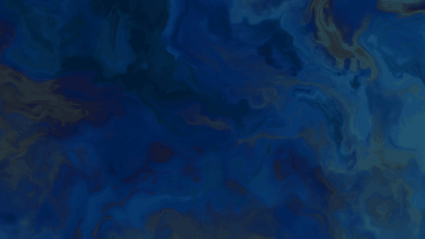
</p>

<h1 align="center">Sensory Space</h1>
<p align="center"><em>Slow light, living sound, room to linger.</em></p>

Light drifts, sound gathers, and a touch makes a bloom and a note. Sensory Space is a slow, generative artwork of light and sound for any screen: a projected wall, a large television, or the laptop on your desk. It runs in a web browser and is generated live, so no two minutes are the same. Twenty scenes explore colour and pattern, with synthesised soundscapes beside them. Made with care for autistic adults: nothing changes suddenly, and the pace, brightness and sound belong to the person in the room.

<p align="center">
  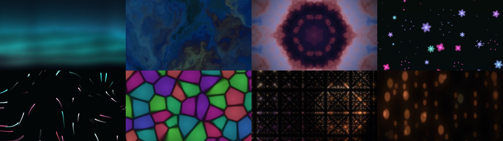
</p>

## Begin in a minute

```bash
git clone https://github.com/jason-chao/sensory_space.git
cd sensory_space
npm install
npm run dev
```

Open the address it prints, press **Begin**, then **Full screen**. Lower the lights if you can, keep the sound soft, and stay awhile.

Or run the published container (section *In a room* below), or open the static build on any web host.

## Twenty scenes

<table>
<tr>
<td align="center">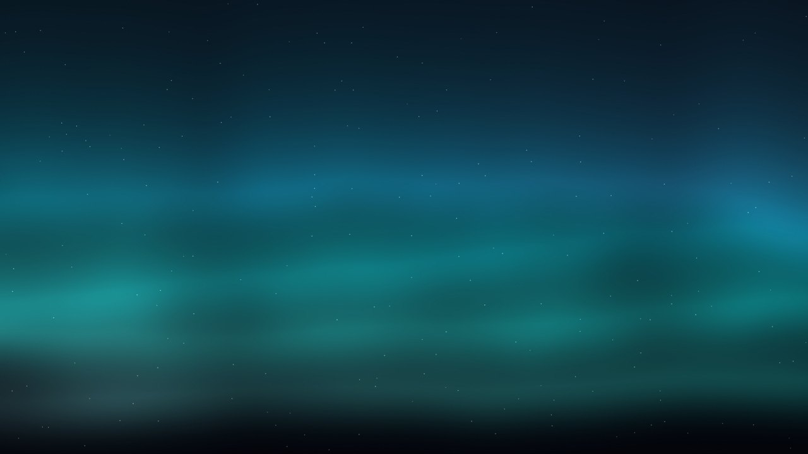<br><b>Aurora</b><br><sub>Slow ribbons of colour across the dark</sub></td>
<td align="center">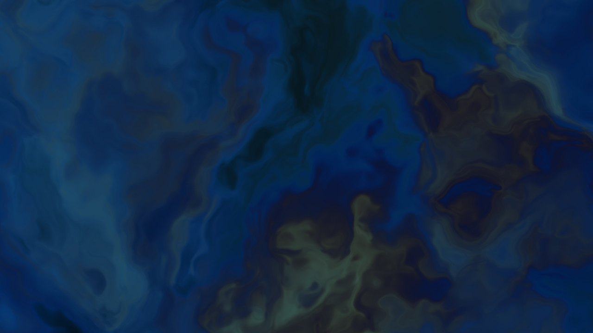<br><b>Ink in water</b><br><sub>Colour unfolding at its own pace</sub></td>
<td align="center">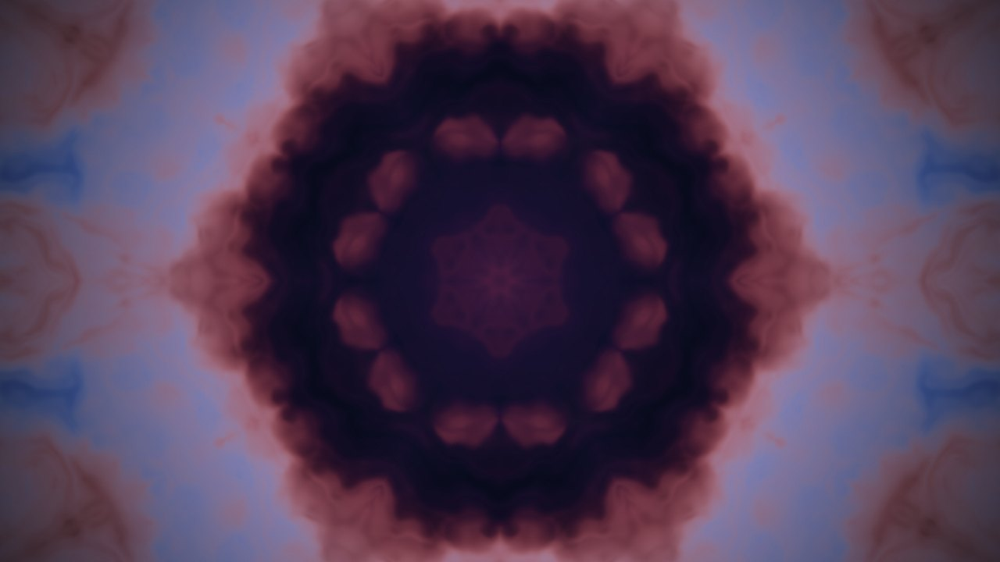<br><b>Kaleidoscope</b><br><sub>Colour finding new symmetries</sub></td>
</tr>
<tr>
<td align="center">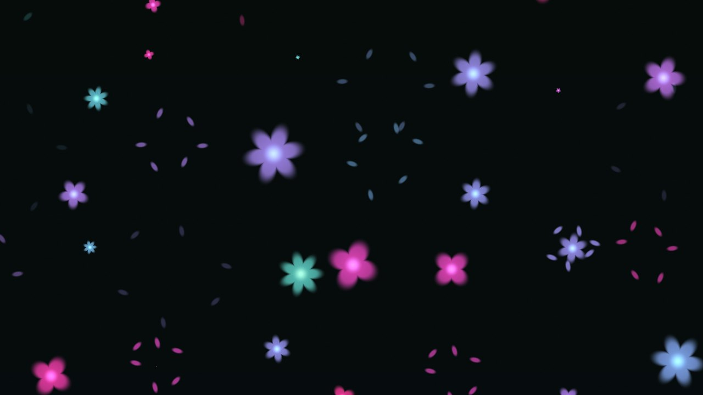<br><b>Flowers</b><br><sub>Touch, and the flowers scatter</sub></td>
<td align="center">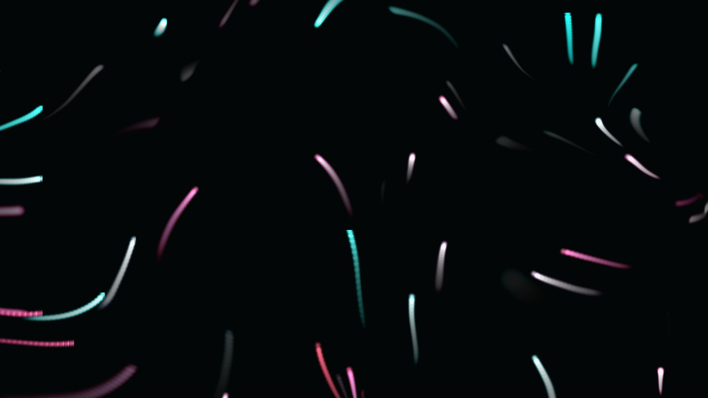<br><b>Water of light</b><br><sub>Light that parts beneath your touch</sub></td>
<td align="center">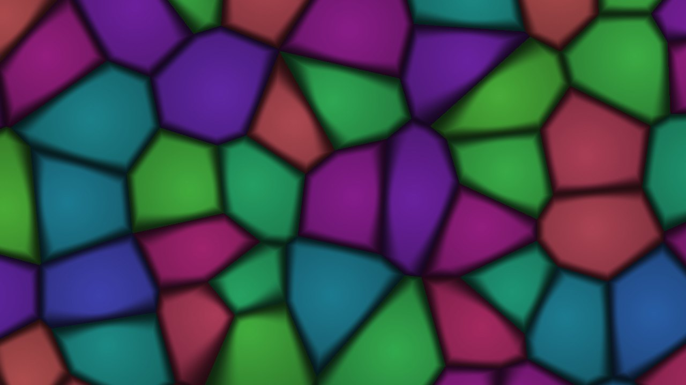<br><b>Sea glass</b><br><sub>Soft colour, held in light</sub></td>
</tr>
<tr>
<td align="center">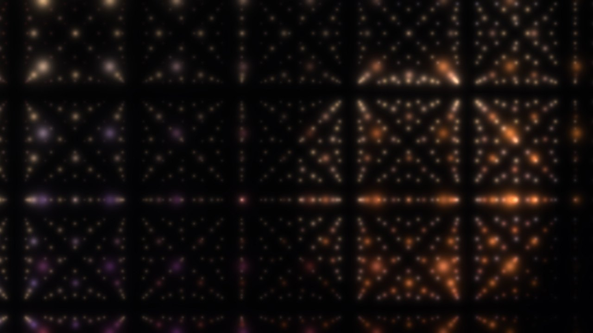<br><b>Light lattice</b><br><sub>A slow geometry of light</sub></td>
<td align="center">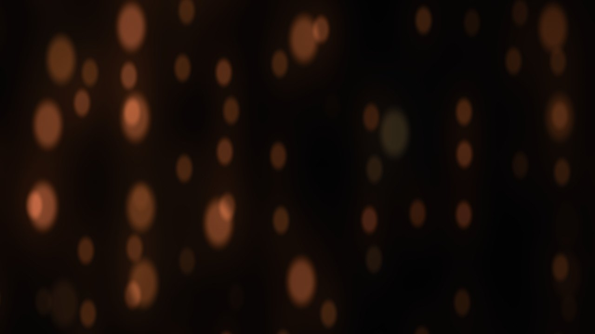<br><b>Resonating lamps</b><br><sub>One lamp passes light to the next</sub></td>
<td align="center">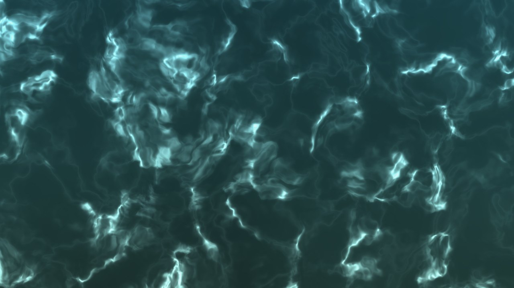<br><b>Pool light</b><br><sub>Sunlight on the floor of a pool</sub></td>
</tr>
<tr>
<td align="center">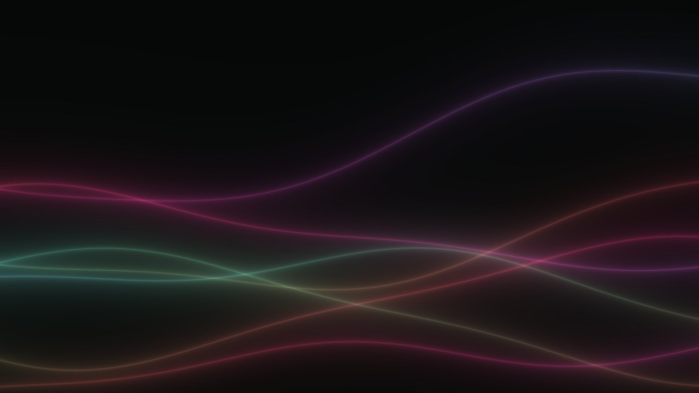<br><b>Silk threads</b><br><sub>Lines that sway like water plants</sub></td>
<td align="center">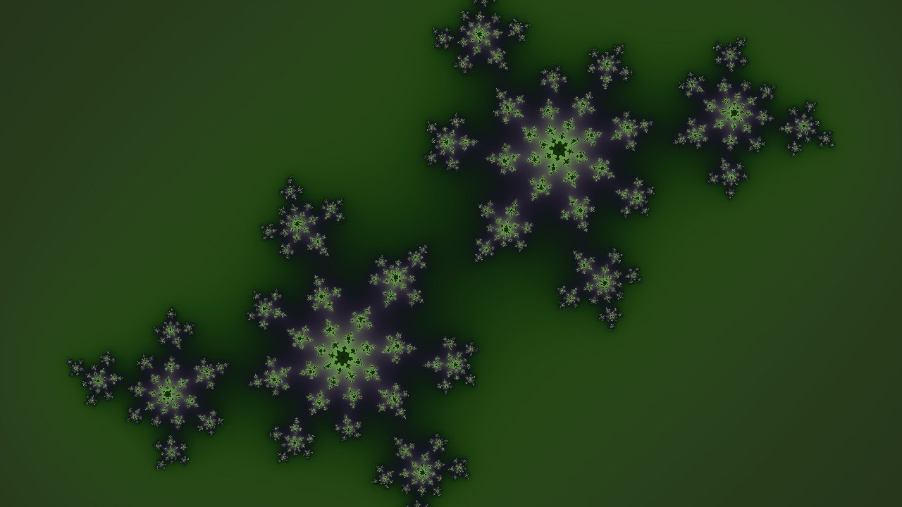<br><b>Fractal garden</b><br><sub>A fractal reshaping itself, slowly</sub></td>
<td align="center">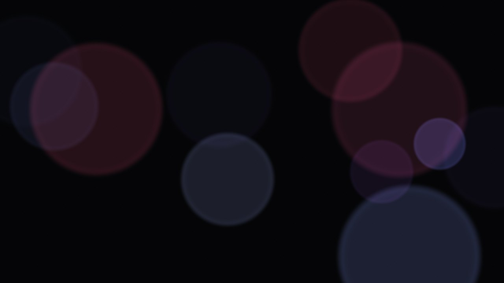<br><b>Lanterns</b><br><sub>Large soft discs of light, drifting</sub></td>
</tr>
</table>

And also: lava lamp, fireflies, breathing orb, night sky, rain on a pond, bubbles, brush strokes, colour wash. Ten palettes, from deep sea to ember. Every scene grows from a seed, so "new variation" gives a pattern no one has seen before.

## Sound

Eleven layers, all synthesised in the browser as you listen: warm drone, chimes, singing bowls, plucked strings, ocean, rain, wind, stream, brown noise, soft pulse, breath. They are arranged into named soundscapes, each described by what plays:

| Soundscape | What plays |
|---|---|
| Shore at dusk | ocean, warm drone, a few chimes |
| Night garden | wind, chimes, quiet drone, a bowl now and then |
| Rainy window | rain, warm drone |
| Temple bells | singing bowls, plucked strings, low drone |
| Mountain stream | stream, light wind, chimes |
| Deep hush | brown noise, low drone, slow pulse |
| Breathing | breath sound at the breathing pace, soft drone, bowls |
| Chimes alone | sparse chimes, nothing else |

Five scales, including two Japanese pentatonic scales. Nothing is recorded or sampled; there is nothing to license.

## Touch, and the space answers

Touch or click the picture: a bloom of light opens and a note sounds. Left to right walks up the scale, so the same place always gives the same note. Some scenes answer in their own way. Lamps pass light to their neighbours. Flowers scatter. Water parts.

## Made with care

- **Everything is yours to set.** Scene, colours, motion, soundscape and volume sit on one bar, with their current values. Settings go deeper, grouped by concept.
- **Nothing changes suddenly.** Every control is followed smoothly. Scenes and palettes cross-fade over six seconds. Sound rises over five.
- **Light is rate-limited by design.** The last stage before the screen limits how fast the brightness of any region may change, whatever a scene, a setting or an input asks for. This keeps the work well inside published flash limits. An automated check drives the renderer through worst cases and fails if it ever sees more than three flashes a second.
- **Ease and Stop.** `E` makes everything dimmer, slower and quieter until pressed again. `X` goes to black and silence at once.
- **Private.** Everything happens in the browser. Nothing is sent anywhere.

The reasoning, the evidence and the decisions are written up in [docs/RESEARCH.md](docs/RESEARCH.md).

## On any screen

Sensory Space works on whatever you have. The bigger the picture, the more it surrounds you, but a small screen still makes a quiet window to look into.

- **A projector** on a plain wall or a ceiling gives the most immersive result.
- **A large television** works beautifully from a sofa. Connect a laptop, or open the page in the television's own browser.
- **A computer, tablet or phone** works too, full screen or in a window beside your work.

Lower the lights if you can. Built-in speakers are fine; headphones or a pair of good speakers bring out the sound. Press `F` for full screen and `H` to hide the controls. The bar and the pointer hide by themselves after a few seconds.

To serve it from a small computer for a room, a gallery or a shared space:

```bash
cp .env.example .env     # ports, https address, bridge upstream
docker compose up -d --build
```

The container serves the app over http and https. Browsers will ask you to accept its self-signed certificate once. Export its root certificate to trust it everywhere:

```bash
docker exec sensory-space cat /data/caddy/pki/authorities/local/root.crt > sensory-space-root.crt
```

For plain static hosting, publish `dist/` after `npm run build` (set `BASE_PATH` for a sub-path).

## Controls

| Key | Action |
|---|---|
| `←` `→` | Previous or next scene |
| `C` `V` | Next or previous colours |
| `+` `−` | Motion faster or slower |
| `[` `]` | Previous or next soundscape |
| `↑` `↓` | Volume up or down |
| `E` | Ease: dimmer, slower and quieter until pressed again |
| `X` | Stop at once: black and silent. Press again to resume |
| `M` | Mute |
| `P` | Hold still |
| `B` | Picture off |
| `F` or double-click | Full screen |
| `S` | Settings |
| `H` | Hide or show the control bar |

## Keep a session

Recording is off unless you start it. A session is a small file of your settings and changes. Sensory Space replays it later, regenerating the same light and sound from the same seed.

## For the curious: body signals

Entirely optional, and nothing else depends on it. In builds that include it, if you happen to have an EEG headband, a small bridge program can let its signals gently tint the colours and tone. Nothing is scored and nothing speeds up when you are tense. The bridge speaks an open format based on Lab Streaming Layer, described in [docs/EEG-BRIDGE-PROTOCOL.md](docs/EEG-BRIDGE-PROTOCOL.md), and **Try demo signals** shows the idea without any hardware.

## For makers

```bash
npm test                      # unit tests
npm run preview &             # the checks below use the preview server
npm run flashcheck            # photosensitivity check on the real renderer
node scripts/audiocheck.mjs   # loudness ceiling check
node scripts/shots.mjs shots  # a still of every scene
```

- **A scene** is one GLSL function of position and time in `src/visual/scenes.ts`. It needs no safety code of its own.
- **A sound layer** is a factory in `src/audio/engine.ts` and a line in `src/audio/voicelist.ts`.
- **A soundscape** or an **intensity preset** is a few lines in `src/core/params.ts`.
- **An input device** is a bridge speaking the protocol, or a `SignalSource` in `src/signals/sources.ts`. The Input tab is a build switch: set `VITE_FEATURE_INPUT=1` (or `FEATURE_INPUT=1` for the container) to include it; the default build and the public site leave it out. For development, also set `EEG_BRIDGE_UPSTREAM` in `.env.local` and the dev server forwards `/bridge/eeg`.

```
src/core      simulation clock, parameters, seeded randomness
src/visual    renderer, brightness limiter, scenes, palettes
src/audio     sound engine and layers
src/signals   signal bus, device sources, EEG analysis, mapping modes
src/record    session recording and replay
src/ui        control bar and settings
docs          research and decisions, plan, protocol
```

## Author and licence

Sensory Space is by **Jason Chao**. Released under the [MIT License](LICENSE).

Give it a wall or a screen, lower the lights, and stay awhile.
