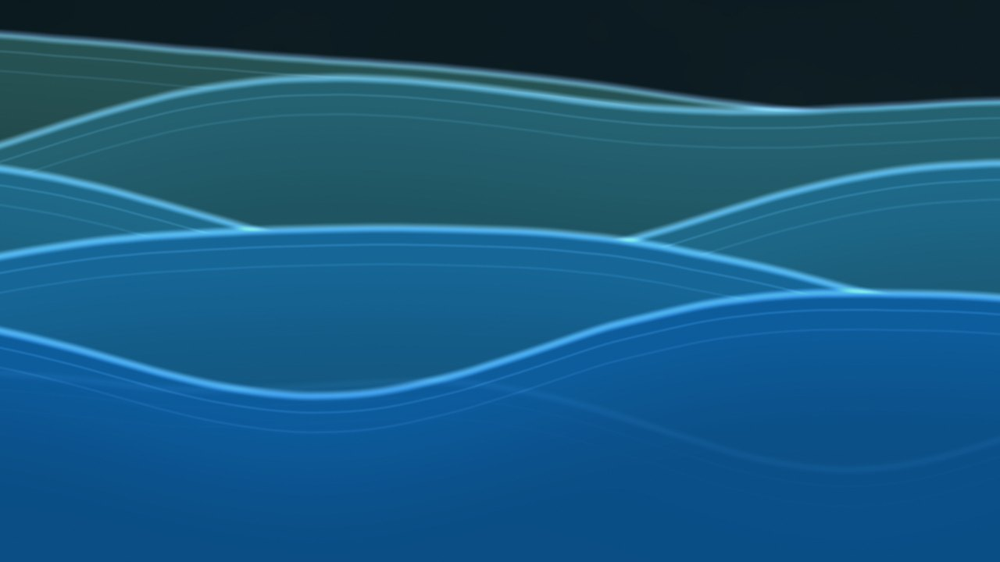
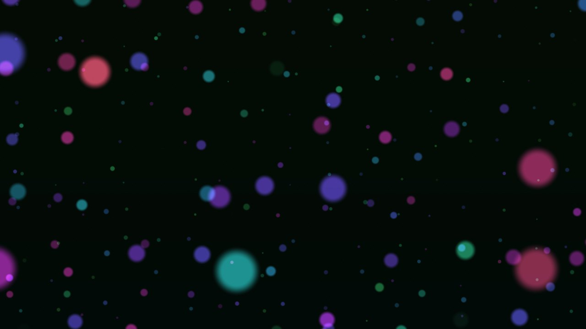

<h1 align="center">Sensory Space</h1>
<p align="center"><em>Slow light, living sound, room to linger.</em></p>

<p align="center">
  <a href="https://sensory-space.org"><strong>Open Sensory Space at sensory-space.org</strong></a>
</p>

<p align="center">
  
</p>

Sensory Space is an artwork of slow light and sound that runs in a web browser. I made it with autistic adults in mind, so scenes and sounds change gradually and the person in the room decides how bright, how fast and how loud it is.

It is also meant to be touched. Drag a finger through the ink and the colour swirls after it. Tap a flower and its petals fly off, then a new bud grows in the same place.

## Begin

Turn your volume down a little and open [sensory-space.org](https://sensory-space.org). The first scene is already moving. Tap the picture, or pick a scene from the row on the opening card, and the sound fades in.

If the room needs to be calmer, press `E` for Ease, which dims and quietens everything until you press it again. `X` goes straight to black and silence.

It works on a phone or a laptop, though it is at its best projected on a wall or shown on a large television in a dim room. Once loaded, it keeps working offline.

## Scenes

There are twenty-one scenes and ten colour palettes, and each scene can grow a new variation of its pattern.

<table>
<tr>
<td align="center"><br>Aurora</td>
<td align="center"><br>Ink in water</td>
<td align="center"><br>Kaleidoscope</td>
</tr>
<tr>
<td align="center"><br>Flowers</td>
<td align="center"><br>Water of light</td>
<td align="center"><br>Sea glass</td>
</tr>
<tr>
<td align="center"><br>Light lattice</td>
<td align="center"><br>Resonating lamps</td>
<td align="center"><br>Pool light</td>
</tr>
<tr>
<td align="center"><br>Silk threads</td>
<td align="center"><br>Rolling waves</td>
<td align="center"><br>Infinite dots</td>
</tr>
</table>

The other nine are lava lamp, fireflies, breathing orb, night sky, rain on a pond, bubbles, lanterns, brush strokes and colour wash.

Each scene answers a touch in its own way. Bubbles pop and grow back, silk threads hum when plucked, and a stone dropped into the rolling waves sends rings across the swell. The rest are there to find.

## Sound

The sound is synthesised as you listen, so it keeps changing. You can choose from soundscapes such as Shore at dusk, Temple bells and Rainy window, or mix the eleven layers yourself in Settings.

It comes from [sensory-sound](https://github.com/jason-chao/sensory-sound), a small sound engine I wrote alongside this project. You can use it in your own work.

## Keys

| Key | Action |
|---|---|
| `←` `→` | Previous or next scene |
| `C` `V` | Next or previous colours |
| `+` `−` | Motion faster or slower |
| `[` `]` | Previous or next soundscape |
| `↑` `↓` | Volume up or down |
| `E` | Ease: dimmer, slower and quieter until pressed again |
| `X` | Black and silent at once; press again to resume |
| `M` | Mute |
| `P` | Hold still |
| `B` | Picture off |
| `F` | Full screen |
| `S` | Settings |
| `H` | Hide or show the control bar |

Your settings are saved on your own device. The public site keeps anonymous counts of which scenes and sounds people use and for how long, with a cookieless counter I host myself. You can opt out under Settings, Help, About.

The research and the feedback behind each design decision are in [docs/RESEARCH.md](docs/RESEARCH.md).

## Running your own copy

You need Node.js 20.19 or later.

```bash
git clone https://github.com/jason-chao/sensory_space.git
cd sensory_space
npm install
npm run dev
```

Open the address it prints. To host it as a static site, run `npm run build` and publish the `dist` folder, setting `BASE_PATH` first if it will live under a sub-path.

For a gallery or a room, there is a container that serves it over both http and https:

```bash
cp .env.example .env          # set the ports and the https address
docker compose up -d --build
```

The https certificate comes from the container's own certificate authority, so browsers warn about it at first. Export the authority's root certificate and install it as trusted on each device you use:

```bash
docker exec sensory-space cat /data/caddy/pki/authorities/local/root.crt > sensory-space-root.crt
```

### Checks

```bash
npm test                         # unit tests
npx playwright install chromium  # once
npm run build && npm run preview &   # the checks below use the preview server
npm run flashcheck               # brightness and colour change on the real renderer
node scripts/audiocheck.mjs      # loudness ceiling
node scripts/shots.mjs shots     # a still of every scene
```

The flash check pushes the renderer through worst cases, such as scenes switched every tenth of a second and brightness slammed between extremes, and fails if any region of the picture, on a 16 by 9 grid, flashes more than three times in a second.

Custom installations can let an EEG headband gently colour the space through a small bridge program. The format it speaks is described in [docs/EEG-BRIDGE-PROTOCOL.md](docs/EEG-BRIDGE-PROTOCOL.md).

## Author and licence

Sensory Space is by Jason Chao and is released under the [MIT licence](LICENSE).
